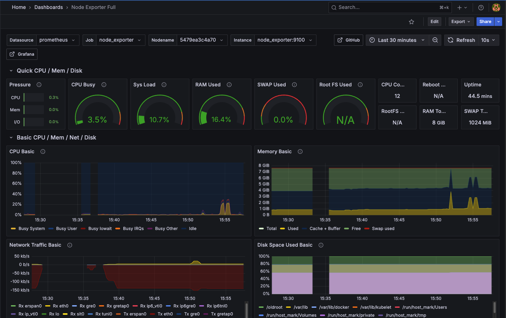

### Prometheus + Grafana + Node Exporter



### Setup
- `docker compose up`
- Open Grafana on http://localhost:3000/
- In Grafana UI, Add Prometheus Data Source wit host http://prometheus:9090
- In Grafana UI, on dashboards tab, click "Import a dashboard" and copy https://grafana.com/grafana/dashboards/1860-node-exporter-full/

### For Fun
- All node exporter metrics can be found at http://localhost:9100/metrics
- In Grafana UI, you can use the "explore" tab to query any metrics you would like from node exporter
- To spike CPU and see updates in dashboard. `docker ps` and find ID of node exporter. Then `docker debug _id_`. Then run some dummy code to spike the CPU
For example,

```
for i in $(seq 1 10000000);
do
  echo $i
done
```

### Packages
1. https://github.com/prometheus/prometheus
2. https://github.com/grafana/grafana
3. https://github.com/prometheus/node_exporter

### Gotchas
- When adding Grafana data source based on docker networking your "Prometheus server URL" may look like http://prometheus:9090 instead of localhost
- Public Grafana Dashboards can all be found at, https://grafana.com/grafana/dashboards/
- Use existing dashboard for node-exporter, https://grafana.com/grafana/dashboards/1860-node-exporter-full/
- in Grafana Dashboards UI, you may want a short scrape interval such as 1s

### My Setup
- Apple M3 Pro
- MacOS Sequoia 15.5
- Docker version 28.1.1, build 4eba377
